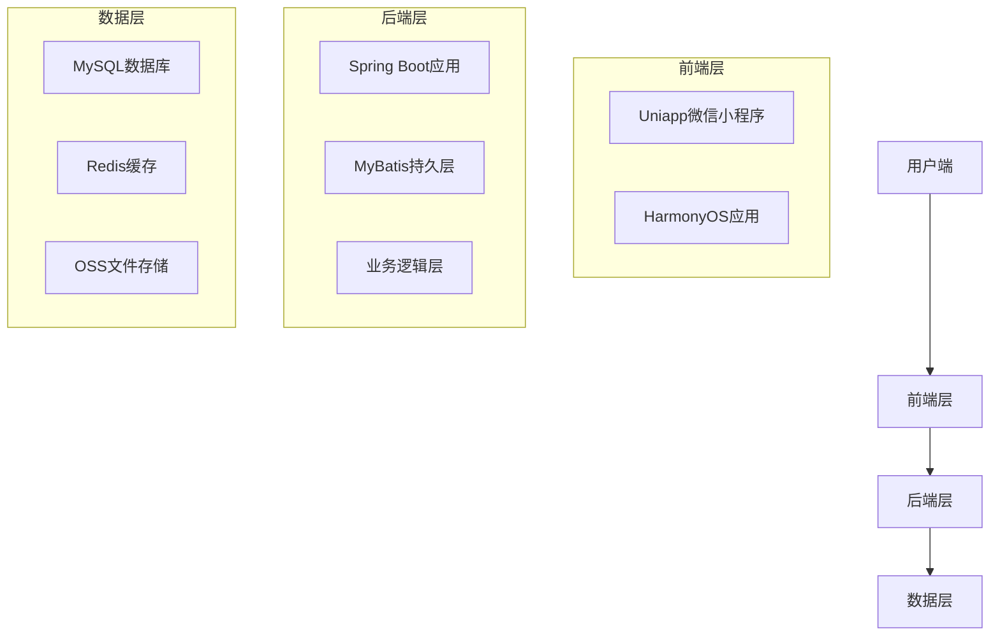

# 大学生资源信息分享平台（经济）概要设计文档

## 1. 系统架构

### 1.1 整体架构

本系统采用经典的三层架构设计，包括前端层、后端层和数据层。



### 1.2 模块划分

| 模块名称 | 功能描述 | 技术实现 |
|---------|---------|----------|
| 用户模块 | 负责用户注册、登录、学生认证等功能 | Spring Boot + MyBatis |
| 活动模块 | 负责优惠活动的发布、查询、收藏等功能 | Spring Boot + MyBatis |
| 帖子模块 | 负责用户经验分享的发布、查询、评论等功能 | Spring Boot + MyBatis |
| 提醒模块 | 负责活动提醒的设置和发送 | Spring Boot + 定时任务 |
| 校园模块 | 负责校内周边优惠和按学校/地区筛选功能 | Spring Boot + MyBatis |
| 前端模块 | 负责用户界面的展示和交互 | Uniapp + HarmonyOS |

## 2. 数据库设计

### 2.1 表结构设计

#### 2.1.1 用户表（user）

| 字段名 | 数据类型 | 约束 | 描述 |
|-------|---------|------|------|
| id | BIGINT | PRIMARY KEY, AUTO_INCREMENT | 用户ID |
| username | VARCHAR(50) | NOT NULL | 用户名 |
| password | VARCHAR(100) | NOT NULL | 密码（加密存储） |
| phone | VARCHAR(20) | UNIQUE, NOT NULL | 手机号 |
| wechat_openid | VARCHAR(100) | UNIQUE | 微信openid |
| student_status | TINYINT | DEFAULT 0 | 学生认证状态（0：未认证，1：已认证） |
| school_id | BIGINT | FOREIGN KEY | 学校ID |
| create_time | DATETIME | DEFAULT CURRENT_TIMESTAMP | 创建时间 |
| update_time | DATETIME | DEFAULT CURRENT_TIMESTAMP ON UPDATE CURRENT_TIMESTAMP | 更新时间 |

#### 2.1.2 学校表（school）

| 字段名 | 数据类型 | 约束 | 描述 |
|-------|---------|------|------|
| id | BIGINT | PRIMARY KEY, AUTO_INCREMENT | 学校ID |
| name | VARCHAR(100) | NOT NULL | 学校名称 |
| region | VARCHAR(50) | NOT NULL | 地区 |
| create_time | DATETIME | DEFAULT CURRENT_TIMESTAMP | 创建时间 |

#### 2.1.3 活动表（activity）

| 字段名 | 数据类型 | 约束 | 描述 |
|-------|---------|------|------|
| id | BIGINT | PRIMARY KEY, AUTO_INCREMENT | 活动ID |
| title | VARCHAR(100) | NOT NULL | 活动标题 |
| description | TEXT | NOT NULL | 活动描述 |
| category | VARCHAR(20) | NOT NULL | 活动分类 |
| source | VARCHAR(50) | NOT NULL | 活动来源 |
| start_time | DATETIME | NOT NULL | 开始时间 |
| end_time | DATETIME | NOT NULL | 结束时间 |
| participate_way | TEXT | NOT NULL | 参与方式 |
| link | VARCHAR(255) | NOT NULL | 活动链接 |
| is_student_exclusive | TINYINT | DEFAULT 0 | 是否学生专属 |
| school_id | BIGINT | FOREIGN KEY | 学校ID（校内活动） |
| create_time | DATETIME | DEFAULT CURRENT_TIMESTAMP | 创建时间 |
| update_time | DATETIME | DEFAULT CURRENT_TIMESTAMP ON UPDATE CURRENT_TIMESTAMP | 更新时间 |

#### 2.1.4 帖子表（post）

| 字段名 | 数据类型 | 约束 | 描述 |
|-------|---------|------|------|
| id | BIGINT | PRIMARY KEY, AUTO_INCREMENT | 帖子ID |
| title | VARCHAR(100) | NOT NULL | 帖子标题 |
| content | TEXT | NOT NULL | 帖子内容 |
| images | VARCHAR(500) | | 图片链接（多个用逗号分隔） |
| link | VARCHAR(255) | | 相关链接 |
| user_id | BIGINT | FOREIGN KEY | 发布用户ID |
| like_count | INT | DEFAULT 0 | 点赞数 |
| comment_count | INT | DEFAULT 0 | 评论数 |
| create_time | DATETIME | DEFAULT CURRENT_TIMESTAMP | 创建时间 |
| update_time | DATETIME | DEFAULT CURRENT_TIMESTAMP ON UPDATE CURRENT_TIMESTAMP | 更新时间 |

#### 2.1.5 评论表（comment）

| 字段名 | 数据类型 | 约束 | 描述 |
|-------|---------|------|------|
| id | BIGINT | PRIMARY KEY, AUTO_INCREMENT | 评论ID |
| post_id | BIGINT | FOREIGN KEY | 帖子ID |
| user_id | BIGINT | FOREIGN KEY | 用户ID |
| content | TEXT | NOT NULL | 评论内容 |
| create_time | DATETIME | DEFAULT CURRENT_TIMESTAMP | 创建时间 |

#### 2.1.6 收藏表（collection）

| 字段名 | 数据类型 | 约束 | 描述 |
|-------|---------|------|------|
| id | BIGINT | PRIMARY KEY, AUTO_INCREMENT | 收藏ID |
| user_id | BIGINT | FOREIGN KEY | 用户ID |
| activity_id | BIGINT | FOREIGN KEY | 活动ID |
| create_time | DATETIME | DEFAULT CURRENT_TIMESTAMP | 收藏时间 |

#### 2.1.7 点赞表（like）

| 字段名 | 数据类型 | 约束 | 描述 |
|-------|---------|------|------|
| id | BIGINT | PRIMARY KEY, AUTO_INCREMENT | 点赞ID |
| user_id | BIGINT | FOREIGN KEY | 用户ID |
| post_id | BIGINT | FOREIGN KEY | 帖子ID |
| create_time | DATETIME | DEFAULT CURRENT_TIMESTAMP | 点赞时间 |

#### 2.1.8 提醒表（reminder）

| 字段名 | 数据类型 | 约束 | 描述 |
|-------|---------|------|------|
| id | BIGINT | PRIMARY KEY, AUTO_INCREMENT | 提醒ID |
| user_id | BIGINT | FOREIGN KEY | 用户ID |
| activity_id | BIGINT | FOREIGN KEY | 活动ID |
| reminder_time | DATETIME | NOT NULL | 提醒时间 |
| status | TINYINT | DEFAULT 0 | 提醒状态（0：未提醒，1：已提醒） |
| create_time | DATETIME | DEFAULT CURRENT_TIMESTAMP | 创建时间 |

### 2.2 数据传输对象（DTOs）

#### 2.2.1 用户相关DTO

- `UserRegisterDTO`：用户注册请求
- `UserLoginDTO`：用户登录请求
- `UserInfoDTO`：用户信息响应
- `StudentAuthDTO`：学生认证请求

#### 2.2.2 活动相关DTO

- `ActivityCreateDTO`：活动创建请求
- `ActivityQueryDTO`：活动查询请求
- `ActivityInfoDTO`：活动信息响应
- `ActivityListDTO`：活动列表响应

#### 2.2.3 帖子相关DTO

- `PostCreateDTO`：帖子创建请求
- `PostQueryDTO`：帖子查询请求
- `PostInfoDTO`：帖子信息响应
- `PostListDTO`：帖子列表响应
- `CommentCreateDTO`：评论创建请求
- `CommentInfoDTO`：评论信息响应

#### 2.2.4 提醒相关DTO

- `ReminderCreateDTO`：提醒创建请求
- `ReminderInfoDTO`：提醒信息响应

## 3. API设计

### 3.1 用户模块API

| API路径 | 方法 | 功能描述 | 请求体（JSON） | 响应体（JSON） |
|---------|------|---------|---------------|---------------|
| `/api/user/register` | POST | 用户注册 | `{"username": "...", "password": "...", "phone": "..."}` | `{"code": 200, "message": "注册成功", "data": {"token": "..."}}` |
| `/api/user/login` | POST | 用户登录 | `{"phone": "...", "password": "..."}` | `{"code": 200, "message": "登录成功", "data": {"token": "...", "user": {...}}}` |
| `/api/user/wechat/login` | POST | 微信登录 | `{"code": "..."}` | `{"code": 200, "message": "登录成功", "data": {"token": "...", "user": {...}}}` |
| `/api/user/student/auth` | POST | 学生认证 | `{"studentId": "...", "schoolId": "...", "name": "..."}` | `{"code": 200, "message": "认证成功"}` |
| `/api/user/info` | GET | 获取用户信息 | N/A | `{"code": 200, "data": {"user": {...}}}` |

### 3.2 活动模块API

| API路径 | 方法 | 功能描述 | 请求体（JSON） | 响应体（JSON） |
|---------|------|---------|---------------|---------------|
| `/api/activity/list` | GET | 获取活动列表 | N/A | `{"code": 200, "data": {"activities": [...]}}` |
| `/api/activity/detail/{id}` | GET | 获取活动详情 | N/A | `{"code": 200, "data": {"activity": {...}}}` |
| `/api/activity/search` | GET | 搜索活动 | N/A | `{"code": 200, "data": {"activities": [...]}}` |
| `/api/activity/collect` | POST | 收藏活动 | `{"activityId": 1}` | `{"code": 200, "message": "收藏成功"}` |
| `/api/activity/uncollect` | POST | 取消收藏 | `{"activityId": 1}` | `{"code": 200, "message": "取消收藏成功"}` |
| `/api/activity/collections` | GET | 获取收藏列表 | N/A | `{"code": 200, "data": {"activities": [...]}}` |

### 3.3 帖子模块API

| API路径 | 方法 | 功能描述 | 请求体（JSON） | 响应体（JSON） |
|---------|------|---------|---------------|---------------|
| `/api/post/list` | GET | 获取帖子列表 | N/A | `{"code": 200, "data": {"posts": [...]}}` |
| `/api/post/detail/{id}` | GET | 获取帖子详情 | N/A | `{"code": 200, "data": {"post": {...}, "comments": [...]}}` |
| `/api/post/create` | POST | 创建帖子 | `{"title": "...", "content": "...", "images": [...], "link": "..."}` | `{"code": 200, "message": "发布成功"}` |
| `/api/post/like` | POST | 点赞帖子 | `{"postId": 1}` | `{"code": 200, "message": "点赞成功"}` |
| `/api/post/unlike` | POST | 取消点赞 | `{"postId": 1}` | `{"code": 200, "message": "取消点赞成功"}` |
| `/api/post/comment` | POST | 评论帖子 | `{"postId": 1, "content": "..."}` | `{"code": 200, "message": "评论成功"}` |

### 3.4 提醒模块API

| API路径 | 方法 | 功能描述 | 请求体（JSON） | 响应体（JSON） |
|---------|------|---------|---------------|---------------|
| `/api/reminder/create` | POST | 创建提醒 | `{"activityId": 1, "reminderTime": "..."}` | `{"code": 200, "message": "提醒设置成功"}` |
| `/api/reminder/list` | GET | 获取提醒列表 | N/A | `{"code": 200, "data": {"reminders": [...]}}` |
| `/api/reminder/delete` | POST | 删除提醒 | `{"reminderId": 1}` | `{"code": 200, "message": "删除成功"}` |

### 3.5 校园模块API

| API路径 | 方法 | 功能描述 | 请求体（JSON） | 响应体（JSON） |
|---------|------|---------|---------------|---------------|
| `/api/campus/schools` | GET | 获取学校列表 | N/A | `{"code": 200, "data": {"schools": [...]}}` |
| `/api/campus/school/activities` | GET | 获取校内活动 | N/A | `{"code": 200, "data": {"activities": [...]}}` |
| `/api/campus/region/activities` | GET | 获取地区活动 | N/A | `{"code": 200, "data": {"activities": [...]}}` |

## 4. 前端设计

### 4.1 页面结构

#### 4.1.1 微信小程序页面

| 页面名称 | 功能描述 | 主要组件 |
|---------|---------|----------|
| 首页 | 展示热门活动和推荐帖子 | 轮播图、活动列表、帖子列表 |
| 活动列表页 | 展示活动分类和活动列表 | 分类导航、活动卡片、筛选器 |
| 活动详情页 | 展示活动详细信息 | 活动信息、收藏按钮、提醒设置 |
| 帖子列表页 | 展示用户分享的经验 | 帖子卡片、搜索框、排序选项 |
| 帖子详情页 | 展示帖子内容和评论 | 帖子内容、评论列表、评论输入框 |
| 发布帖子页 | 用户发布经验分享 | 标题输入、内容编辑器、图片上传 |
| 个人中心页 | 展示用户信息和个人数据 | 用户信息、收藏列表、发布记录 |
| 学生认证页 | 用户进行学生身份认证 | 表单输入、提交按钮 |
| 提醒列表页 | 展示用户设置的活动提醒 | 提醒列表、删除按钮 |

#### 4.1.2 HarmonyOS应用页面

| 页面名称 | 功能描述 | 主要组件 |
|---------|---------|----------|
| 主页面 | 展示热门活动和推荐帖子 | 轮播图、活动列表、帖子列表 |
| 活动页 | 展示活动分类和活动列表 | 分类导航、活动卡片、筛选器 |
| 活动详情页 | 展示活动详细信息 | 活动信息、收藏按钮、提醒设置 |
| 社区页 | 展示用户分享的经验 | 帖子卡片、搜索框、排序选项 |
| 帖子详情页 | 展示帖子内容和评论 | 帖子内容、评论列表、评论输入框 |
| 发布页 | 用户发布经验分享 | 标题输入、内容编辑器、图片上传 |
| 我的页 | 展示用户信息和个人数据 | 用户信息、收藏列表、发布记录 |
| 认证页 | 用户进行学生身份认证 | 表单输入、提交按钮 |
| 提醒页 | 展示用户设置的活动提醒 | 提醒列表、删除按钮 |

### 4.2 前端交互设计

- **导航栏**：底部导航栏，包含首页、活动、社区、我的等核心入口
- **下拉刷新**：支持下拉刷新获取最新数据
- **上拉加载**：支持上拉加载更多数据
- **点击事件**：点击活动卡片进入活动详情页，点击帖子卡片进入帖子详情页
- **表单提交**：用户注册、登录、学生认证等表单提交
- **弹窗**：收藏成功、点赞成功等操作反馈弹窗
- **倒计时**：活动倒计时显示

## 5. 后端设计

### 5.1 核心类设计

#### 5.1.1 用户模块

- `UserController`：处理用户相关的HTTP请求
- `UserService`：实现用户相关的业务逻辑
- `UserMapper`：操作用户数据的MyBatis接口
- `User`：用户实体类

#### 5.1.2 活动模块

- `ActivityController`：处理活动相关的HTTP请求
- `ActivityService`：实现活动相关的业务逻辑
- `ActivityMapper`：操作活动数据的MyBatis接口
- `Activity`：活动实体类

#### 5.1.3 帖子模块

- `PostController`：处理帖子相关的HTTP请求
- `PostService`：实现帖子相关的业务逻辑
- `PostMapper`：操作帖子数据的MyBatis接口
- `Post`：帖子实体类
- `CommentService`：实现评论相关的业务逻辑
- `CommentMapper`：操作评论数据的MyBatis接口
- `Comment`：评论实体类

#### 5.1.4 提醒模块

- `ReminderController`：处理提醒相关的HTTP请求
- `ReminderService`：实现提醒相关的业务逻辑
- `ReminderMapper`：操作提醒数据的MyBatis接口
- `Reminder`：提醒实体类
- `ReminderTask`：定时任务，用于发送活动提醒

#### 5.1.5 校园模块

- `CampusController`：处理校园相关的HTTP请求
- `CampusService`：实现校园相关的业务逻辑
- `SchoolMapper`：操作学校数据的MyBatis接口
- `School`：学校实体类

### 5.2 核心业务流程

#### 5.2.1 用户注册流程

1. 接收用户注册请求
2. 验证手机号是否已注册
3. 对密码进行加密处理
4. 创建用户记录
5. 生成JWT令牌
6. 返回注册成功响应

#### 5.2.2 活动发布流程

1. 接收活动发布请求
2. 验证用户权限
3. 保存活动信息
4. 返回发布成功响应

#### 5.2.3 帖子发布流程

1. 接收帖子发布请求
2. 验证用户登录状态
3. 保存帖子信息
4. 返回发布成功响应

#### 5.2.4 提醒设置流程

1. 接收提醒设置请求
2. 验证用户登录状态
3. 保存提醒信息
4. 返回设置成功响应

#### 5.2.5 活动提醒流程

1. 定时任务扫描即将到期的提醒
2. 发送提醒通知给用户
3. 更新提醒状态

## 6. 部署设计

### 6.1 部署架构

- **开发环境**：本地开发环境，使用IDE进行开发和调试
- **测试环境**：独立的测试服务器，用于功能测试和性能测试
- **生产环境**：正式部署服务器，提供线上服务

### 6.2 技术选型

| 组件 | 版本 | 用途 |
|------|------|------|
| JDK | 1.8+ | Java运行环境 |
| Spring Boot | 2.7+ | 后端框架 |
| MyBatis | 3.5+ | ORM框架 |
| MySQL | 8.0+ | 数据库 |
| Redis | 6.0+ | 缓存 |
| Nginx | 1.18+ | 反向代理 |
| Docker | 20.10+ | 容器化部署 |

### 6.3 部署步骤

1. 构建后端应用：`mvn clean package`
2. 构建前端应用：`npm run build`
3. 配置数据库：创建数据库和表结构
4. 配置Redis：设置缓存
5. 配置Nginx：设置反向代理
6. 启动应用：使用Docker容器启动应用

## 7. 测试设计

### 7.1 单元测试

- **测试框架**：JUnit 5 + Mockito
- **测试范围**：核心业务逻辑，如用户认证、活动管理、帖子管理等
- **测试覆盖率**：目标覆盖率达到80%以上

### 7.2 接口测试

- **测试工具**：PostMan/Apifox
- **测试范围**：核心API接口，如用户注册登录、活动查询、帖子发布等
- **测试用例**：覆盖正常场景和异常场景

### 7.3 前端UI自动化测试

- **测试工具**：Selenium（Web端）/ Appium（移动端）
- **测试范围**：核心操作流程，如用户登录、活动查看、帖子发布等
- **测试用例**：模拟用户操作，验证界面功能和交互

## 8. 代码规范

### 8.1 Java代码规范

- 遵循阿里巴巴Java开发规范
- 使用4个空格进行缩进
- 类名使用驼峰命名法（首字母大写）
- 方法名和变量名使用驼峰命名法（首字母小写）
- 常量使用全大写，单词间用下划线分隔
- 每行代码长度不超过120个字符
- 方法注释使用Javadoc格式

### 8.2 前端代码规范

- 遵循ESLint规范
- 使用2个空格进行缩进
- 类名使用帕斯卡命名法（首字母大写）
- 方法名和变量名使用驼峰命名法（首字母小写）
- 常量使用全大写，单词间用下划线分隔
- 每行代码长度不超过100个字符
- 组件注释使用JSDoc格式

## 9. 项目结构

### 9.1 后端项目结构

```
src/
  ├── main/
  │   ├── java/
  │   │   └── com/
  │   │       └── campusecohub/
  │   │           ├── controller/      # 控制器
  │   │           ├── service/         # 服务层
  │   │           ├── mapper/          # MyBatis接口
  │   │           ├── entity/          # 实体类
  │   │           ├── dto/             # 数据传输对象
  │   │           ├── config/          # 配置类
  │   │           ├── util/            # 工具类
  │   │           └── Application.java # 应用入口
  │   └── resources/
  │       ├── application.yml         # 应用配置
  │       ├── mapper/                 # MyBatis映射文件
  │       └── static/                 # 静态资源
  └── test/                           # 测试代码
```

### 9.2 前端项目结构

```
├── src/
│   ├── components/      # 公共组件
│   ├── pages/           # 页面
│   ├── utils/           # 工具类
│   ├── api/             # API请求
│   ├── store/           # 状态管理
│   ├── styles/          # 样式文件
│   └── main.js          # 应用入口
├── static/              # 静态资源
├── unpackage/           # 打包输出
├── vue.config.js        # Vue配置
├── package.json         # 项目依赖
└── manifest.json        # 应用配置
```

## 10. 开发计划

### 10.1 开发阶段

| 阶段 | 任务 | 时间估计 |
|------|------|----------|
| 需求分析 | 分析需求，编写需求分析文档 | 2天 |
| 概要设计 | 设计系统架构，编写概要设计文档 | 3天 |
| 详细设计 | 设计数据库表结构，编写详细设计文档 | 2天 |
| 后端开发 | 实现后端API接口 | 7天 |
| 前端开发 | 实现微信小程序和HarmonyOS应用 | 10天 |
| 测试 | 单元测试、接口测试、UI自动化测试 | 5天 |
| 部署 | 部署到生产环境 | 2天 |
| 上线 | 系统上线，收集用户反馈 | 1天 |

### 10.2 里程碑

- **里程碑1**：需求分析和概要设计完成
- **里程碑2**：后端API接口开发完成
- **里程碑3**：前端应用开发完成
- **里程碑4**：测试完成，系统上线

## 11. 风险评估

| 风险点 | 描述 | 应对措施 |
|-------|------|----------|
| 技术风险 | 前端多端适配可能存在兼容性问题 | 充分测试不同设备和平台，使用Uniapp的跨平台能力 |
| 性能风险 | 随着用户量增加，系统性能可能下降 | 优化数据库查询，使用Redis缓存，考虑分布式部署 |
| 安全风险 | 用户数据和活动信息可能面临安全威胁 | 加强系统安全措施，定期进行安全审计 |
| 运营风险 | 平台内容质量可能参差不齐 | 建立内容管理机制，鼓励高质量内容的创作和分享 |
| 时间风险 | 开发时间可能超出预期 | 合理规划开发任务，设置优先级，及时调整计划 |
