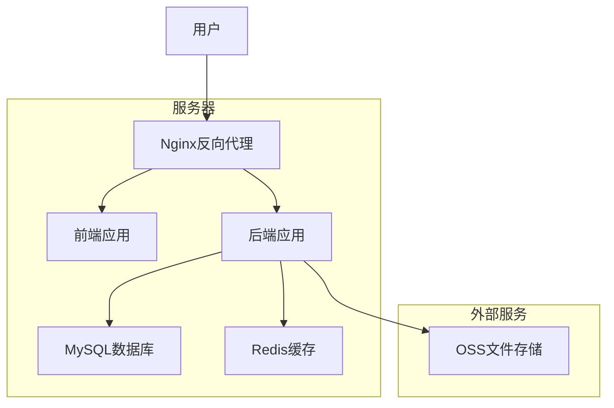
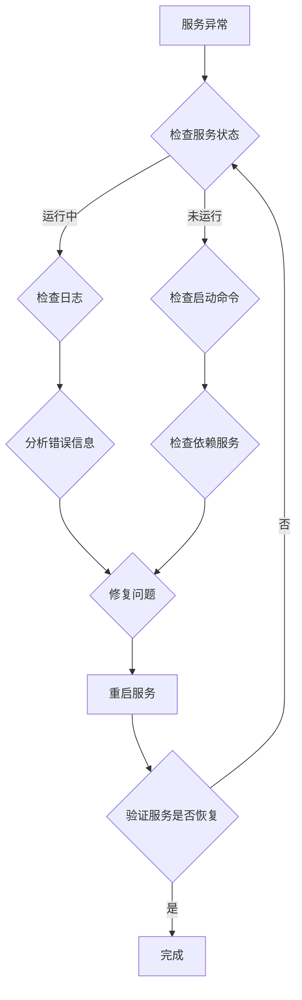

# 大学生资源信息分享平台（经济）项目部署说明

## 1. 部署环境准备

### 1.1 硬件要求

| 环境 | CPU | 内存 | 存储 | 网络 |
|------|-----|------|------|------|
| 开发环境 | 2核及以上 | 4GB及以上 | 50GB及以上 | 100Mbps及以上 |
| 测试环境 | 4核及以上 | 8GB及以上 | 100GB及以上 | 100Mbps及以上 |
| 生产环境 | 8核及以上 | 16GB及以上 | 200GB及以上 | 1Gbps及以上 |

### 1.2 软件要求

| 软件 | 版本 | 用途 |
|------|------|------|
| JDK | 1.8+ | Java运行环境 |
| Maven | 3.6+ | 项目构建工具 |
| Node.js | 14+ | 前端构建工具 |
| MySQL | 8.0+ | 数据库 |
| Redis | 6.0+ | 缓存 |
| Nginx | 1.18+ | 反向代理 |
| Docker | 20.10+ | 容器化部署 |
| Docker Compose | 1.29+ | 容器编排 |

## 2. 后端部署

### 2.1 代码准备

1. 克隆代码仓库：
   ```bash
   git clone https://github.com/yourname/CampusEcoHub.git
   cd CampusEcoHub/backend
   ```

2. 配置数据库连接：
   编辑 `src/main/resources/application.yml` 文件，修改数据库连接信息：
   ```yaml
   spring:
     datasource:
       url: jdbc:mysql://localhost:3306/campusecohub?useUnicode=true&characterEncoding=utf-8&useSSL=false&serverTimezone=Asia/Shanghai
       username: root
       password: 123456
   ```

3. 配置Redis连接：
   ```yaml
   spring:
     redis:
       host: localhost
       port: 6379
       password: 
       database: 0
   ```

### 2.2 构建项目

1. 编译打包：
   ```bash
   mvn clean package -DskipTests
   ```

2. 构建Docker镜像：
   ```bash
   docker build -t campusecohub-backend .
   ```

### 2.3 启动服务

1. 使用Docker Compose启动服务：
   ```bash
   docker-compose up -d
   ```

2. 验证服务是否启动成功：
   ```bash
   docker ps
   ```

   检查 `campusecohub-backend` 容器是否在运行。

## 3. 前端部署

### 3.1 微信小程序部署

1. 代码准备：
   ```bash
   cd CampusEcoHub/frontend/uniapp
   ```

2. 安装依赖：
   ```bash
   npm install
   ```

3. 构建项目：
   ```bash
   npm run build:mp-weixin
   ```

4. 部署到微信小程序：
   - 打开微信开发者工具
   - 导入 `unpackage/dist/build/mp-weixin` 目录
   - 提交代码审核
   - 发布上线

### 3.2 HarmonyOS应用部署

1. 代码准备：
   ```bash
   cd CampusEcoHub/frontend/harmony
   ```

2. 安装依赖：
   ```bash
   npm install
   ```

3. 构建项目：
   ```bash
   npm run build:harmony
   ```

4. 部署到HarmonyOS：
   - 打开DevEco Studio
   - 导入项目
   - 配置签名信息
   - 构建并发布应用

## 4. 数据库部署

### 4.1 创建数据库

1. 登录MySQL：
   ```bash
   mysql -u root -p
   ```

2. 创建数据库：
   ```sql
   CREATE DATABASE campusecohub CHARACTER SET utf8mb4 COLLATE utf8mb4_unicode_ci;
   ```

3. 导入数据库表结构：
   ```bash
   mysql -u root -p campusecohub < sql/schema.sql
   ```

### 4.2 初始化数据

1. 导入初始数据：
   ```bash
   mysql -u root -p campusecohub < sql/data.sql
   ```

   初始数据包括：
   - 学校信息
   - 活动分类
   - 管理员账号

## 5. Nginx配置

### 5.1 安装Nginx

```bash
apt-get update
apt-get install nginx
```

### 5.2 配置Nginx

编辑 `/etc/nginx/conf.d/campusecohub.conf` 文件：

```nginx
upstream backend {
    server localhost:8080;
}

server {
    listen 80;
    server_name campusecohub.com;

    location /api/ {
        proxy_pass http://backend/;
        proxy_set_header Host $host;
        proxy_set_header X-Real-IP $remote_addr;
        proxy_set_header X-Forwarded-For $proxy_add_x_forwarded_for;
    }

    location / {
        root /path/to/frontend/dist;
        index index.html;
        try_files $uri $uri/ /index.html;
    }
}
```

### 5.3 重启Nginx

```bash
nginx -t
nginx -s reload
```

## 6. 监控与维护

### 6.1 日志管理

1. 后端日志：
   ```bash
docker logs campusecohub-backend
   ```

2. Nginx日志：
   ```bash
   tail -f /var/log/nginx/access.log
   tail -f /var/log/nginx/error.log
   ```

### 6.2 性能监控

1. 使用Prometheus和Grafana监控系统性能
2. 配置MySQL慢查询日志，优化数据库性能
3. 使用Redis监控工具监控缓存使用情况

### 6.3 常见问题排查

| 问题 | 可能原因 | 解决方案 |
|------|---------|----------|
| 后端服务无法启动 | 数据库连接失败 | 检查数据库配置和连接状态 |
| 前端无法访问后端API | Nginx配置错误 | 检查Nginx配置和后端服务状态 |
| 活动提醒不生效 | 定时任务未启动 | 检查后端定时任务配置 |
| 图片上传失败 | OSS配置错误 | 检查OSS配置和权限 |

## 7. 安全配置

### 7.1 数据库安全

1. 创建专用数据库用户，限制权限：
   ```sql
   CREATE USER 'campusecohub'@'localhost' IDENTIFIED BY 'password';
   GRANT ALL PRIVILEGES ON campusecohub.* TO 'campusecohub'@'localhost';
   FLUSH PRIVILEGES;
   ```

2. 开启MySQL安全模式，禁用远程root登录

### 7.2 服务器安全

1. 配置防火墙，只开放必要的端口：
   ```bash
   ufw allow 80/tcp
   ufw allow 443/tcp
   ufw allow 3306/tcp
   ufw enable
   ```

2. 定期更新系统和软件包：
   ```bash
   apt-get update
   apt-get upgrade
   ```

### 7.3 应用安全

1. 配置HTTPS，使用SSL证书：
   - 申请SSL证书
   - 配置Nginx使用HTTPS

2. 实现API接口认证和授权
3. 防止SQL注入、XSS等攻击
4. 对敏感数据进行加密存储

## 8. 备份与恢复

### 8.1 数据库备份

1. 定期备份数据库：
   ```bash
   mysqldump -u root -p campusecohub > backup_$(date +%Y%m%d).sql
   ```

2. 自动备份脚本：
   ```bash
   #!/bin/bash
   DATE=$(date +%Y%m%d)
   BACKUP_DIR=/path/to/backup
   mysqldump -u root -p campusecohub > $BACKUP_DIR/backup_$DATE.sql
   # 保留最近7天的备份
   find $BACKUP_DIR -name "backup_*.sql" -mtime +7 -delete
   ```

### 8.2 恢复数据

1. 停止服务：
   ```bash
   docker-compose down
   ```

2. 恢复数据库：
   ```bash
   mysql -u root -p campusecohub < backup_20230101.sql
   ```

3. 启动服务：
   ```bash
   docker-compose up -d
   ```

## 9. 升级与维护

### 9.1 版本升级

1. 停止服务：
   ```bash
   docker-compose down
   ```

2. 拉取最新代码：
   ```bash
   git pull
   ```

3. 重新构建和启动：
   ```bash
   mvn clean package -DskipTests
   docker-compose up -d --build
   ```

### 9.2 日常维护

1. 检查系统状态：
   ```bash
   docker ps
   docker stats
   ```

2. 清理日志：
   ```bash
   docker logs campusecohub-backend --tail 100 > backend.log
   docker logs campusecohub-mysql --tail 100 > mysql.log
   ```

3. 优化数据库：
   ```bash
   mysql -u root -p -e "ANALYZE TABLE campusecohub.user, campusecohub.activity, campusecohub.post;"
   ```

## 10. 部署架构图



## 11. 部署注意事项

1. **环境变量配置**：生产环境应使用环境变量配置敏感信息，如数据库密码、API密钥等
2. **容器编排**：使用Docker Compose或Kubernetes进行容器编排，确保服务的高可用性
3. **负载均衡**：生产环境应配置负载均衡，提高系统的并发处理能力
4. **监控告警**：配置监控系统，及时发现和处理系统异常
5. **灾备方案**：制定完善的灾备方案，确保系统在遇到故障时能够快速恢复
6. **安全审计**：定期进行安全审计，发现并修复安全漏洞
7. **文档更新**：及时更新部署文档，确保文档与实际部署情况一致

## 12. 故障处理

### 12.1 服务无法启动

1. 检查容器状态：
   ```bash
   docker ps -a
   ```

2. 查看容器日志：
   ```bash
   docker logs campusecohub-backend
   ```

3. 检查数据库连接：
   ```bash
   mysql -u root -p
   ```

4. 检查端口占用：
   ```bash
   netstat -tulpn | grep 8080
   ```

### 12.2 数据库连接失败

1. 检查数据库服务状态：
   ```bash
   systemctl status mysql
   ```

2. 检查数据库连接配置：
   ```bash
   cat src/main/resources/application.yml
   ```

3. 测试数据库连接：
   ```bash
   mysql -h localhost -u campusecohub -p
   ```

### 12.3 前端无法访问

1. 检查Nginx状态：
   ```bash
   systemctl status nginx
   ```

2. 检查Nginx配置：
   ```bash
   nginx -t
   ```

3. 检查前端文件是否存在：
   ```bash
   ls -la /path/to/frontend/dist
   ```

4. 检查网络连接：
   ```bash
   ping campusecohub.com
   ```

## 13. 附录

### 13.1 常用命令

| 命令 | 用途 |
|------|------|
| `docker-compose up -d` | 启动服务 |
| `docker-compose down` | 停止服务 |
| `docker-compose logs` | 查看服务日志 |
| `docker-compose build` | 重新构建服务 |
| `mvn clean package` | 构建后端项目 |
| `npm run build:mp-weixin` | 构建微信小程序 |
| `npm run build:harmony` | 构建HarmonyOS应用 |
| `mysql -u root -p campusecohub < backup.sql` | 恢复数据库 |

### 13.2 配置文件模板

#### application.yml 模板

```yaml
spring:
  datasource:
    url: jdbc:mysql://localhost:3306/campusecohub?useUnicode=true&characterEncoding=utf-8&useSSL=false&serverTimezone=Asia/Shanghai
    username: campusecohub
    password: password
  redis:
    host: localhost
    port: 6379
    password: 
    database: 0
  servlet:
    multipart:
      max-file-size: 10MB
      max-request-size: 10MB

mybatis:
  mapper-locations: classpath:mapper/*.xml
  type-aliases-package: com.campusecohub.entity

server:
  port: 8080
  servlet:
    context-path: /

logging:
  level:
    com.campusecohub: info

jwt:
  secret: your-secret-key
  expire: 86400
```

#### docker-compose.yml 模板

```yaml
version: '3'
services:
  backend:
    build: .
    ports:
      - "8080:8080"
    depends_on:
      - mysql
      - redis
    environment:
      - SPRING_DATASOURCE_URL=jdbc:mysql://mysql:3306/campusecohub?useUnicode=true&characterEncoding=utf-8&useSSL=false&serverTimezone=Asia/Shanghai
      - SPRING_DATASOURCE_USERNAME=campusecohub
      - SPRING_DATASOURCE_PASSWORD=password
      - SPRING_REDIS_HOST=redis
      - SPRING_REDIS_PORT=6379

  mysql:
    image: mysql:8.0
    ports:
      - "3306:3306"
    environment:
      - MYSQL_ROOT_PASSWORD=root
      - MYSQL_DATABASE=campusecohub
      - MYSQL_USER=campusecohub
      - MYSQL_PASSWORD=password
    volumes:
      - mysql-data:/var/lib/mysql
      - ./sql:/docker-entrypoint-initdb.d

  redis:
    image: redis:6.0
    ports:
      - "6379:6379"
    volumes:
      - redis-data:/data

volumes:
  mysql-data:
  redis-data:
```

### 13.3 故障排除流程图


